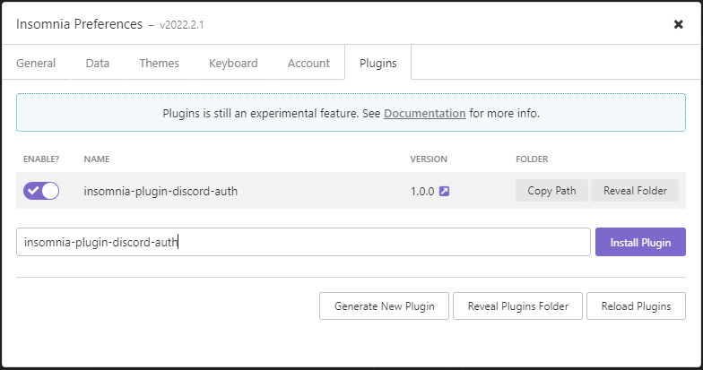
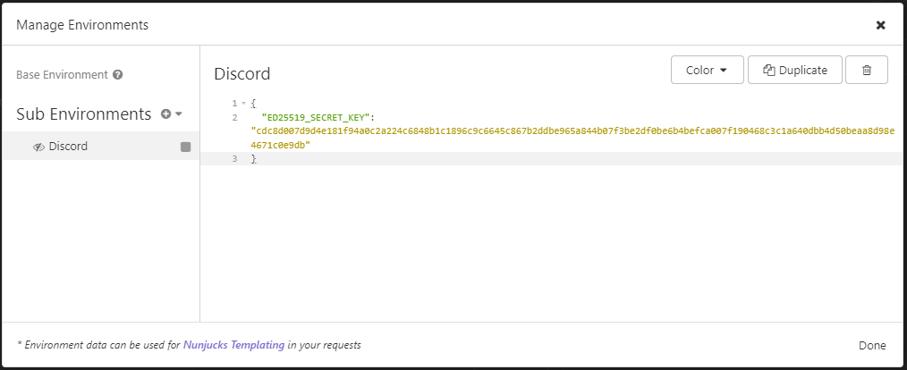
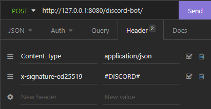
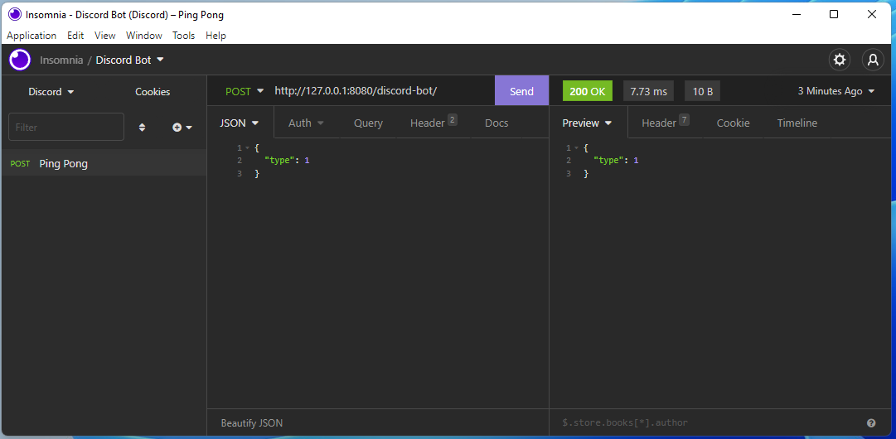
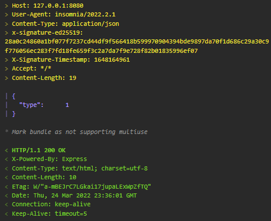

# Insomnia Plugin Discord Auth

This plugin signs API requests using the [Ed25519](https://en.wikipedia.org/wiki/EdDSA#Ed25519) digital signature scheme. This scheme
is used by Discord when making WebHook requests of a Discord App server. See [Discord Security and Authorization](https://discord.com/developers/docs/interactions/receiving-and-responding#security-and-authorization).

## 🚀 Installation

- Access the Application / Preferences menu and then select the Plugins tab, enter the plugin name `insomnia-plugin-discord-auth` and click Install Plugin.

- After installing the plugin click on enable



## Generating a Key Pair

Discord do not share their secret key, so for testing you will need to generate your
own key pair. A helper NodeJS app `generate-keypair.js` is included:

```sh
> node generate-keypair.js
secretKey: cdc8d007d9d4e181f94a0c2a224c6848b1c1896c9c6645c867b2ddbe965a844b07f3be2df0be6b4befca007f190468c3c1a640dbb4d50beaa8d98e4671c0e9db
publicKey: 07f3be2df0be6b4befca007f190468c3c1a640dbb4d50beaa8d98e4671c0e9db
```

## Adding Environment Var

- Create an Environment variable called `ED25519_SECRET_KEY` with a valid hex-encoded secret from a ED25519 key-pair. It is recommended that you put this in a `Private Environment` so that the key isn't exported or synced by Insomnia.



## Add Header to each Request

- Add a custom Header called `x-signature-ed25519` with the value of `#DISCORD#`. This tells the plug-in to intercept this request, and add the required signing header



## Send a Request

- Click on `Send`, and the plug-in will intercept the request, add the required `x-signature-ed25519` and `x-signature-timestamp` headers, before the request is sent to the destination server



## View Logs

You can see from the Timeline view that the plug-in is successfully adding the signature and timestamp headers to the request



## Example Bot Code

I'm also including some sample code for the Bot server receiving this request.
```diff
- Sorry - This is cut-paste from my production code, and hasn't been run/tested
```

```javascript

const express = require('express');
const dfcbp = require('./dfc-bot-plus.js')
const nacl = require('tweetnacl');

// Constants
const PORT = 8080;
const HOST = '0.0.0.0';

// App
const app = express();

// Discord enumerations
const InteractionResponseType = {
    Pong: 1,
    ChannelMessageWithSource: 4,
    DeferredChannelMessageWithSource: 5
  };

const InteractionType = {
    Ping: 1,
    ApplicationCommand: 2
};

// Use the Raw handler, as we need to create/compare
// the signature of the raw body
app.use(express.raw({"type":"*/*"}));

// Main POST handler
app.post('/discord-bot/', async (req,res) => {
  const signatureEd25519 = req.get('x-signature-ed25519');
  const signatureTimestamp = req.get('x-signature-timestamp');
  const requestBody = req.body.toString('utf8');

  try {
    res.status(200).send(
      await discordHandler(requestBody, signatureEd25519, signatureTimestamp));

  } catch (err) {
    res.status(500).send(err.message)
  }
});

// Start the listener
app.listen(PORT, HOST);

console.log(`Running on http://${HOST}:${PORT}`);

// Main Discord Request Handler
async discordHandler(requestBody, signatureEd25519, signatureTimestamp){

    // Validate Input
    if (signatureEd25519 == null ||
        signatureTimestamp == null ||
        requestBody == null)
    {
        throw new Error("Invalid Parameters");
    }

    // Parse the Body
    const body = JSON.parse(requestBody);
    const discordRequestType = body.type;
    const bodyData = body.data;

    // Validate Body
    if (discordRequestType == null || 
        !Number.isInteger(discordRequestType))
    {
        throw new Error("Invalid Discord Request Type");
    }

    if (process.env.ENV == "DEV") {
        // ############## THE DEVELOPMENT PUBLIC KEY YOIU GENERATED  ABOVE #########################
        var signaturePublicKey = "07f3be2df0be6b4befca007f190468c3c1a640dbb4d50beaa8d98e4671c0e9db";
    } else {
        // ############## THE PRODUCTION PUBLIC KEY FROM DISCORD  ##################################
        var signaturePublicKey = "NEED TO REPLACE";
    }

    var isVerified = nacl.sign.detached.verify(
        Buffer.from(signatureTimestamp + requestBody),
        Buffer.from(signatureEd25519, 'hex'),
        Buffer.from(signaturePublicKey, 'hex')
    );

    if (!isVerified) {
        console.debug("Signature FAILED verification"); 
        throw new Error("Invalid Request Signature");
    }
    else {
        console.debug("Signing verified"); 
    }

    // Handle Events
    switch (discordRequestType) {

        // === PING Response
        case InteractionType.Ping:
            return JSON.stringify({"type": InteractionResponseType.Pong});

        // === Normal Response
        case InteractionType.ApplicationCommand:
            // DO SOMETHING ELSE
            return "";
    }
}
```
